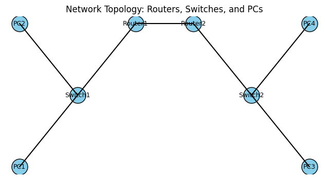

# PacketTracerNetworkLab

This lab uses **Cisco Packet Tracer**, a free network simulation tool provided by Cisco Networking Academy, to build and configure a small network topology and practice basic network administration tasks.

## Prerequisites

- Register for the free [Getting Started with Cisco Packet Tracer](https://www.netacad.com/) course to download the latest version of Packet Tracer. Cisco's learning collection explains that Packet Tracer lets you practice networking, IoT and cybersecurity skills virtually and step into a virtual lab【431533042137856†L151-L170】.
- Install Cisco Packet Tracer on your computer.

## Lab Topology

The following topology will be used:



- Two routers (Router1 and Router2) interconnect the two network segments.
- Two switches connect end-user PCs to the routers.
- Four PCs represent hosts in two separate subnets.

## Steps

1. **Build the topology**
   - Launch Packet Tracer and create a new project.
   - From the device palette, drag two **Routers** (e.g., 2911) onto the workspace.
   - Add two **Switches** (e.g., 2960) and four **PCs**.
   - Use the copper straight-through cable tool to connect PCs to switches, switches to routers, and routers to each other following the topology diagram.

2. **Assign IP addresses**

   | Device | Interface | IP Address | Subnet Mask |
   | ------ | --------- | ---------- | ----------- |
   | PC1 | NIC | 192.168.1.10 | 255.255.255.0 |
   | PC2 | NIC | 192.168.1.20 | 255.255.255.0 |
   | Router1 | G0/0 | 192.168.1.1 | 255.255.255.0 |
   | Router1 | G0/1 | 10.0.0.1 | 255.255.255.252 |
   | Router2 | G0/0 | 192.168.2.1 | 255.255.255.0 |
   | Router2 | G0/1 | 10.0.0.2 | 255.255.255.252 |
   | PC3 | NIC | 192.168.2.10 | 255.255.255.0 |
   | PC4 | NIC | 192.168.2.20 | 255.255.255.0 |

3. **Configure routers**
   On **Router1**, configure interfaces and a static route:

   ```
   conf t
   interface g0/0
     ip address 192.168.1.1 255.255.255.0
     no shutdown
   exit
   interface g0/1
     ip address 10.0.0.1 255.255.255.252
     no shutdown
   exit
   ip route 192.168.2.0 255.255.255.0 10.0.0.2
   end
...
   On **Router2**, configure interfaces and a static route:

   ```
   conf t
   interface g0/0
     ip address 192.168.2.1 255.255.255.0
     no shutdown
   exit
   interface g0/1
     ip address 10.0.0.2 255.255.255.252
     no shutdown
   exit
   ip route 192.168.1.0 255.255.255.0 10.0.0.1
   end
   ```

4. **Test connectivity**

   - Use the **Simulation** tab in Packet Tracer to send pings from PC1 to PC3 and PC4.
   - Observe how packets traverse the network across routers and switches. Cisco's learning collection notes that Packet Tracer allows you to watch how data travels, expand your network, integrate IoT devices or practice automation with Python.
   - Ensure that pings are successful; enable DHCP, configure VLANS, add an IoT device, or use Packet Tracer's Python scripting to automate tasks.
